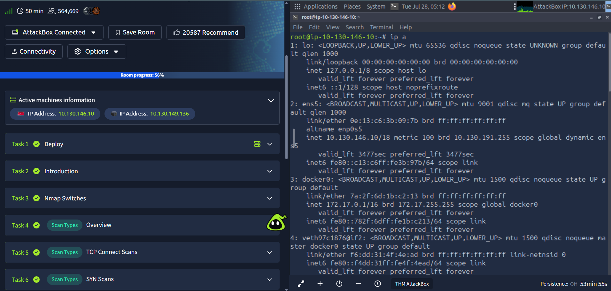
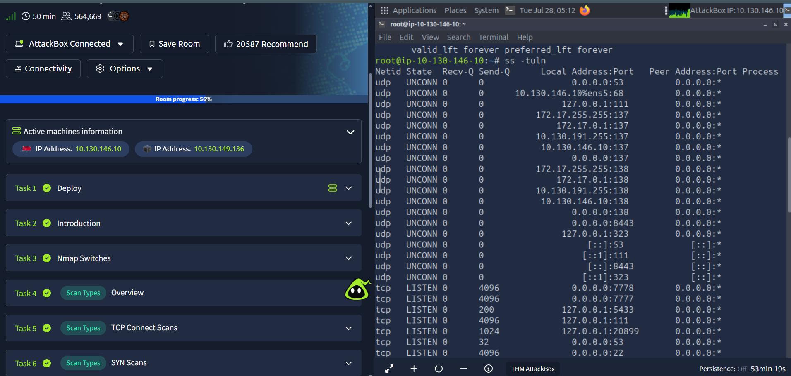
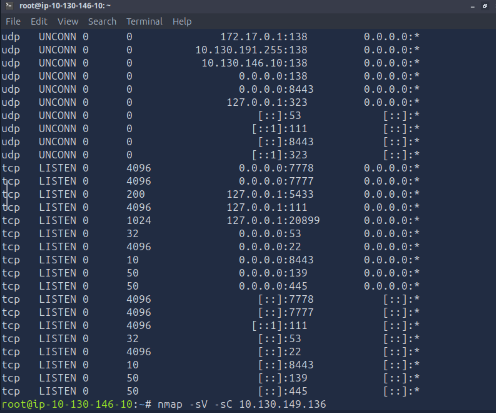
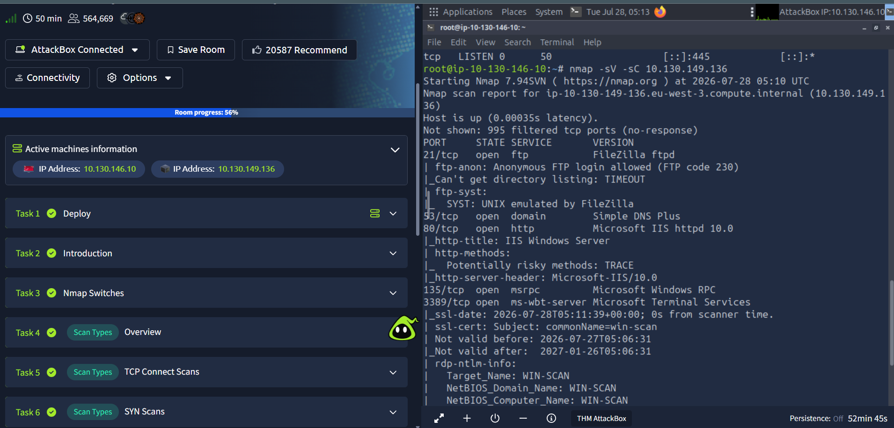

# Sessão 01 – Introdução ao Linux para Segurança e Comandos de Rede

## Objetivo

O objetivo deste laboratório foi utilizar comandos básicos do Linux para identificar a configuração da máquina local e realizar o reconhecimento de um servidor remoto utilizando o Nmap. Foram analisadas as interfaces de rede, os serviços em execução e as portas abertas do sistema alvo.

---

## Ambiente

- Plataforma: TryHackMe (AttackBox)
- Sistema Operativo: Linux
- Ferramentas utilizadas:
  - Nmap
  - ip
  - ss

---

# Identificação da Interface de Rede

## Comando

```bash
ip a
```

## Resultado

Interface principal:

- **ens5**
- **Endereço IP:** `10.130.146.10/18`



---

# Serviços em Escuta na Máquina Local

## Comando

```bash
ss -tuln
```

## Portas TCP identificadas

| Porta | Serviço |
|--------|----------|
| 22 | SSH |
| 53 | DNS |
| 111 | RPC / rpcbind |
| 139 | NetBIOS Session Service |
| 445 | SMB |
| 5433 | PostgreSQL |
| 7777 | Aplicação TCP |
| 7778 | Aplicação TCP |
| 8443 | HTTPS (porta alternativa) |
| 20899 | Aplicação TCP |

## Portas UDP identificadas

| Porta | Serviço |
|--------|----------|
| 53 | DNS |
| 111 | RPC / rpcbind |
| 138 | NetBIOS Datagram Service |
| 323 | NTP (Chrony) |
| 8443 | Aplicação UDP |





---

# Scan Nmap

## Comando executado

```bash
nmap -sV -sC 10.130.149.136
```

## Portas abertas identificadas

| Porta | Estado | Serviço | Versão |
|--------|---------|----------|---------|
| 21 | Open | FTP | FileZilla ftpd |
| 53 | Open | DNS | Simple DNS Plus |
| 80 | Open | HTTP | Microsoft IIS HTTPD 10.0 |
| 135 | Open | MSRPC | Microsoft Windows RPC |
| 3389 | Open | RDP | Microsoft Terminal Services |

## Informações adicionais

- Login FTP anónimo permitido.
- Servidor Web Microsoft IIS 10.0.
- Método HTTP TRACE ativo.
- Certificado SSL identificado no serviço RDP.
- Nome do computador remoto: **WIN-SCAN**.



---

# Aprendizagens

Durante este laboratório foi possível praticar:

- Utilização dos comandos `ip a` e `ss -tuln`;
- Identificação da interface de rede da máquina local;
- Enumeração das portas em escuta;
- Utilização do Nmap para reconhecimento de redes;
- Identificação de serviços e versões em execução;
- Interpretação da superfície de ataque de um sistema remoto.

---

# Conclusão

Este laboratório permitiu consolidar conhecimentos básicos de Linux e de reconhecimento de redes, utilizando ferramentas essenciais para identificar interfaces de rede, serviços em execução e portas abertas, bem como realizar a enumeração de um sistema remoto através do Nmap.
