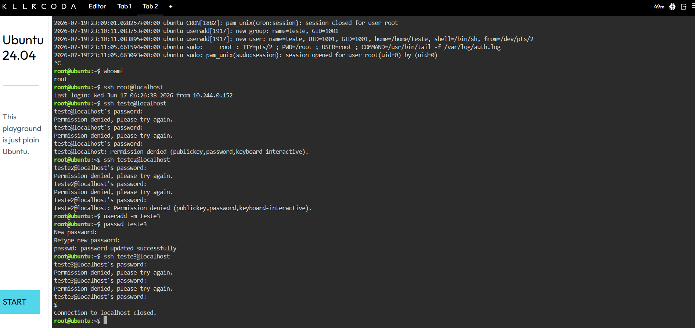

# Sessão 02 – Auditoria de Sistemas Linux e Análise Avançada de Logs

## Objetivo

O objetivo deste laboratório foi analisar os registos de autenticação do sistema Linux para identificar tentativas de acesso falhadas, determinar a origem das ligações e verificar se ocorreu um acesso bem-sucedido.

---

## Ambiente

- Plataforma: KillerCoda
- Sistema Operativo: Ubuntu 24.04
- Ferramentas utilizadas:
  - grep
  - awk
  - sort
  - uniq

---

# Preparação do Laboratório

Para gerar eventos de autenticação, foram criados utilizadores locais e realizados vários testes de login através de SSH.

## Comandos utilizados

```bash
useradd -m teste
passwd teste
ssh teste@localhost
```

Após várias tentativas com credenciais incorretas, foi efetuado um login com sucesso.



---

# Análise de Tentativas Falhadas

## Comando

```bash
grep "Failed password" auth.log
```

Este comando permitiu identificar todas as tentativas de autenticação falhadas registadas no sistema.

### Contagem das tentativas

```bash
grep "Failed password" auth.log | awk '{print $11}' | sort | uniq -c | sort -nr
```

Resultado obtido:

| Origem | Número de tentativas |
|--------|---------------------:|
| 127.0.0.1 | 4 |

---

# Identificação de Logins Bem-sucedidos

## Comando

```bash
grep -E "Accepted password|Accepted publickey" auth.log
```

Foi identificado um login com sucesso para o utilizador **teste3**.

---

# Resultados Obtidos

| Informação | Resultado |
|------------|-----------|
| Origem das ligações | 127.0.0.1 |
| Utilizador afetado | teste3 |
| Tipo de autenticação | Password |
| Estado final | Login bem-sucedido |

---

# Linha Temporal

| Hora | Evento |
|------|--------|
| 23:16:09 | Primeira tentativa falhada |
| 23:16:11 | Nova tentativa falhada |
| 23:16:14 | Login efetuado com sucesso |
| 23:16:25 | Sessão SSH terminada |

---

# Aprendizagens

Durante este laboratório pratiquei:

- Análise do ficheiro `auth.log`;
- Pesquisa de eventos utilizando `grep`;
- Contagem de ocorrências com `awk`, `sort` e `uniq`;
- Identificação de tentativas falhadas de autenticação;
- Identificação de logins bem-sucedidos;
- Construção de uma linha temporal baseada em logs.

---

# Conclusão

Este laboratório permitiu compreender como os ficheiros de log podem ser utilizados para identificar tentativas de acesso não autorizadas, confirmar logins bem-sucedidos e reconstruir a sequência de eventos ocorridos durante uma investigação forense. :contentReference[oaicite:2]{index=2}
