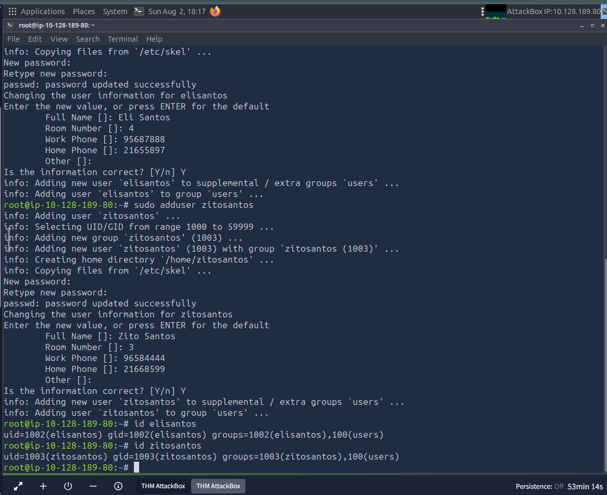
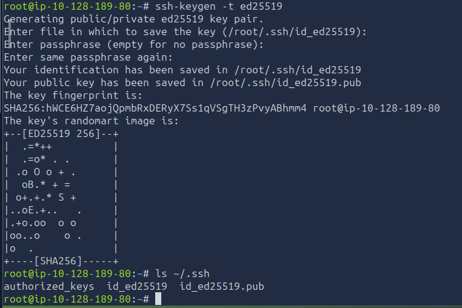
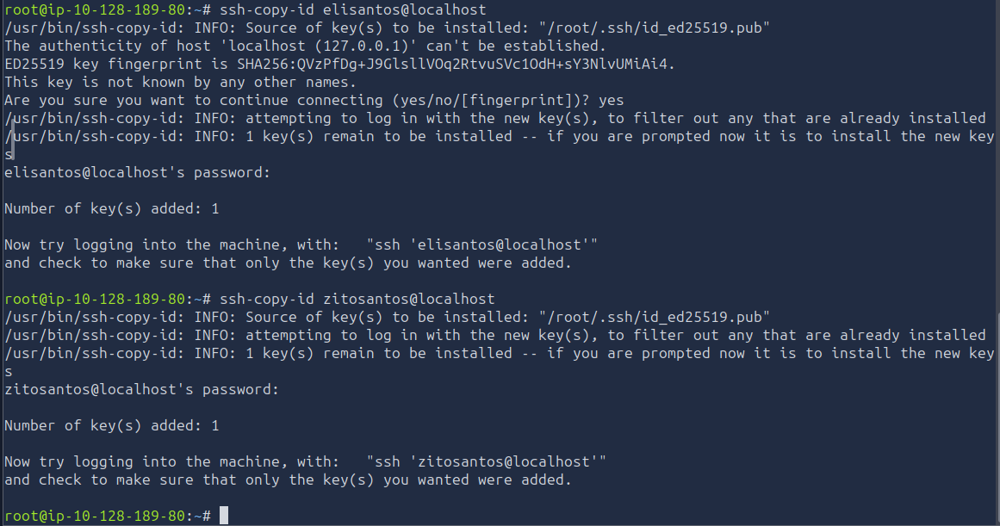
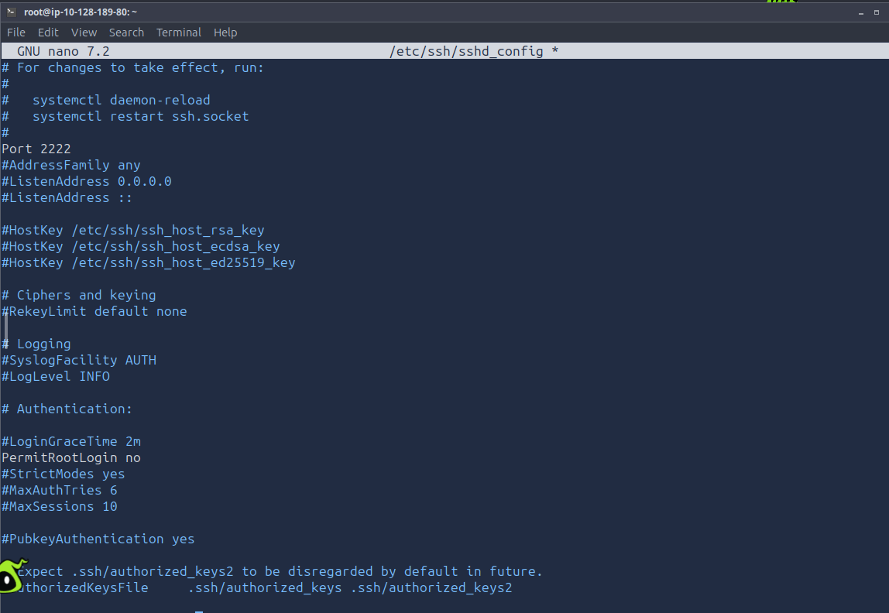
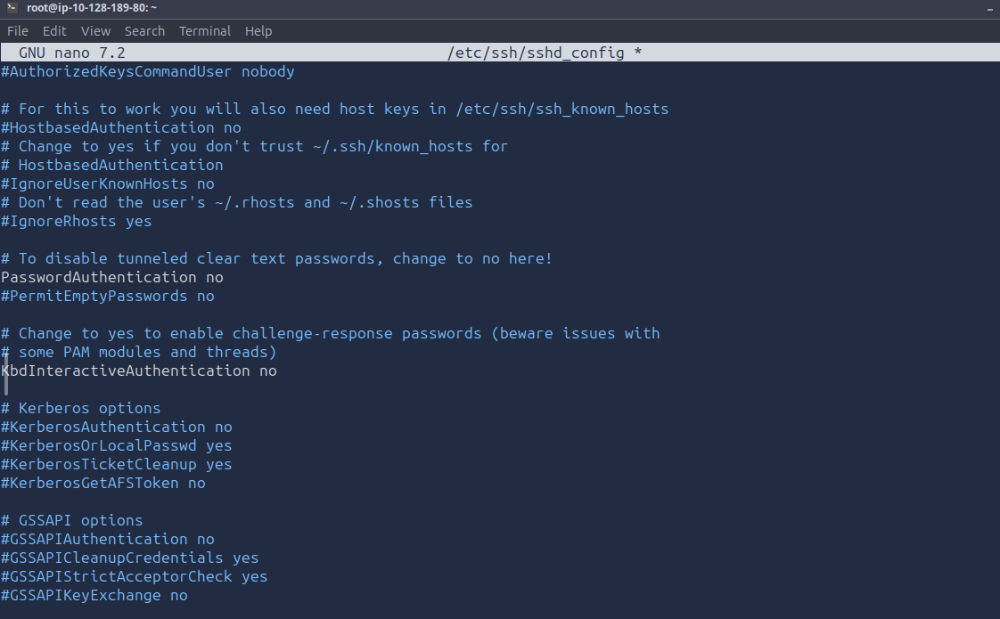
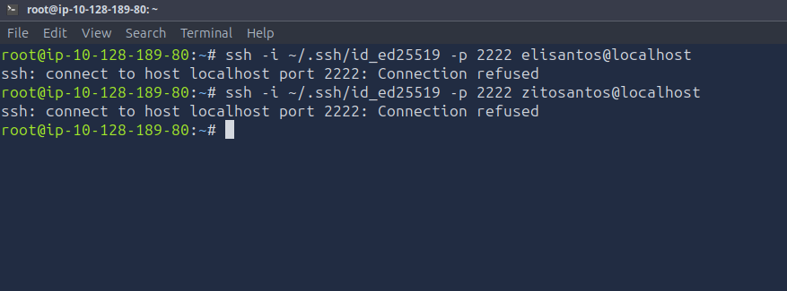

# Sessão 04 – Gestão Segura de Acessos Remotos SSH em Linux

## Objetivo

O objetivo deste laboratório foi reforçar a segurança do acesso remoto SSH através da criação de utilizadores de teste, utilização de autenticação por chave criptográfica Ed25519 e alteração das configurações do servidor SSH.

---

## Ambiente

- Plataforma: TryHackMe AttackBox
- Sistema Operativo: Ubuntu Linux
- Serviço analisado: OpenSSH
- Ferramentas utilizadas:
  - `ssh-keygen`
  - `ssh-copy-id`
  - `ssh`
  - `nano`
  - `sshd`

---

## 1. Criação dos utilizadores

Foram criados dois utilizadores de teste:

```bash
sudo adduser elisantos
sudo adduser zitosantos
```

A criação foi confirmada com:

```bash
id elisantos
id zitosantos
```

Resultados:

```text
uid=1002(elisantos) gid=1002(elisantos) groups=1002(elisantos),100(users)
uid=1003(zitosantos) gid=1003(zitosantos) groups=1003(zitosantos),100(users)
```



---

## 2. Geração do par de chaves SSH

Foi gerado um par de chaves Ed25519 com o seguinte comando:

```bash
ssh-keygen -t ed25519
```

As chaves foram guardadas em:

```text
/root/.ssh/id_ed25519
/root/.ssh/id_ed25519.pub
```

A chave privada deve permanecer protegida e nunca deve ser publicada no repositório.



---

## 3. Transferência da chave pública

A chave pública foi copiada para os utilizadores através do comando `ssh-copy-id`:

```bash
ssh-copy-id elisantos@localhost
ssh-copy-id zitosantos@localhost
```

Em ambos os casos, o sistema confirmou:

```text
Number of key(s) added: 1
```

Isto indica que a chave pública foi adicionada ao ficheiro `authorized_keys` dos utilizadores.



---

## 4. Alteração da configuração SSH

Foi editado o ficheiro de configuração do servidor SSH:

```bash
sudo nano /etc/ssh/sshd_config
```

Foram aplicadas as seguintes configurações:

```text
Port 2222
PermitRootLogin no
PasswordAuthentication no
```

### Explicação

- `Port 2222`: altera a porta padrão do SSH de 22 para 2222.
- `PermitRootLogin no`: impede o login direto do utilizador root.
- `PasswordAuthentication no`: desativa o acesso por palavra-passe, permitindo apenas autenticação por chave.





---

## 5. Validação da configuração

A sintaxe do ficheiro foi validada com:

```bash
sudo sshd -t
```

O comando não apresentou erros de sintaxe.

---

## 6. Teste de autenticação por chave

Foram realizados testes de acesso com os comandos:

```bash
ssh -i ~/.ssh/id_ed25519 -p 2222 elisantos@localhost
ssh -i ~/.ssh/id_ed25519 -p 2222 zitosantos@localhost
```

O resultado foi:

```text
ssh: connect to host localhost port 2222: Connection refused
```



---

## Limitação encontrada

O teste final não foi concluído com sucesso porque o serviço SSH continuou sem aceitar ligações na porta 2222.

O erro `Connection refused` indica que não existia nenhum serviço em escuta nessa porta no momento do teste.

Além disso, o laboratório foi executado na AttackBox e o endereço `localhost` representa a própria AttackBox. Por esse motivo, o teste não representou uma ligação entre uma máquina cliente e uma máquina servidor separada.

---

## Resultado do laboratório

| Etapa | Estado |
|---|---|
| Criação dos utilizadores | Concluída |
| Geração das chaves Ed25519 | Concluída |
| Transferência das chaves públicas | Concluída |
| Alteração do `sshd_config` | Concluída |
| Validação da sintaxe | Concluída |
| Login por chave na porta 2222 | Não concluído |

---

## Aprendizagens

Durante este laboratório foi possível praticar:

- criação de utilizadores Linux;
- geração de chaves SSH Ed25519;
- utilização do comando `ssh-copy-id`;
- configuração do servidor OpenSSH;
- desativação do login de root;
- desativação da autenticação por palavra-passe;
- alteração da porta padrão do SSH;
- interpretação do erro `Connection refused`.

---

## Conclusão

O laboratório permitiu compreender o processo de migração da autenticação SSH por palavra-passe para autenticação por chave criptográfica.

Apesar de o login final na porta 2222 não ter sido concluído, foram realizadas com sucesso as etapas de criação dos utilizadores, geração e transferência das chaves, edição do ficheiro `sshd_config` e validação da sua sintaxe.

A principal dificuldade encontrada esteve relacionada com a aplicação efetiva da nova porta no serviço SSH e com o facto de os testes terem sido realizados utilizando `localhost` na própria AttackBox.
