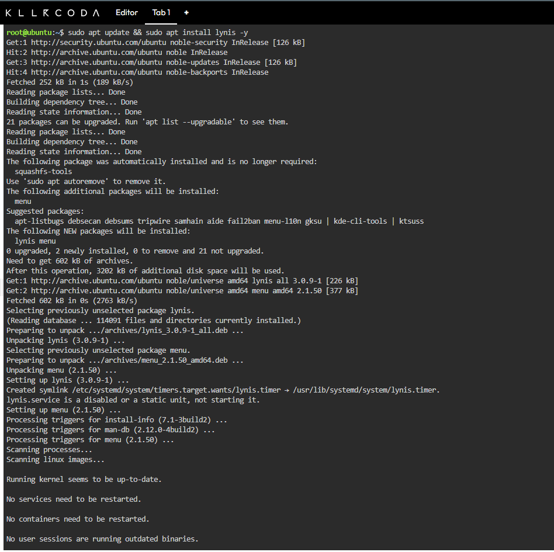
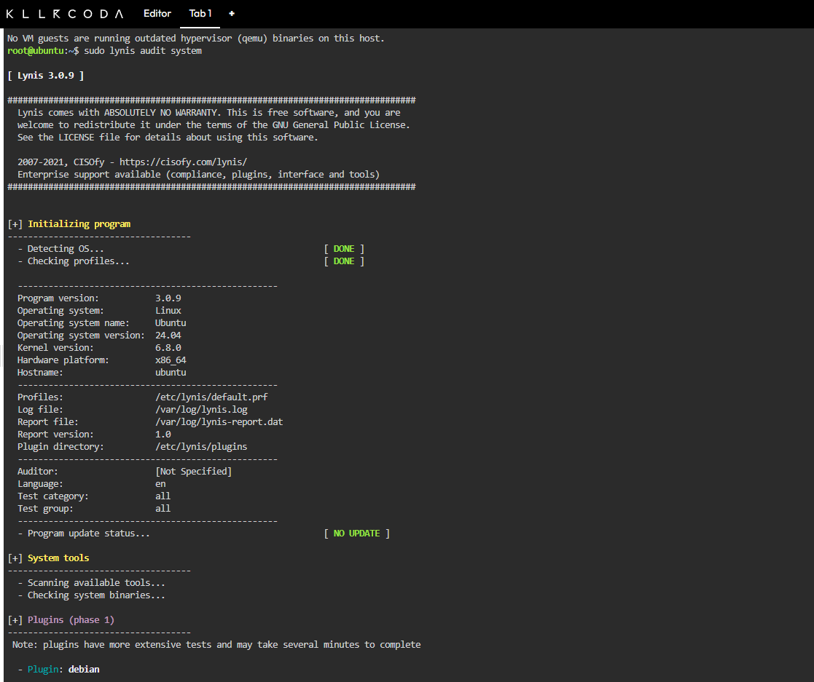
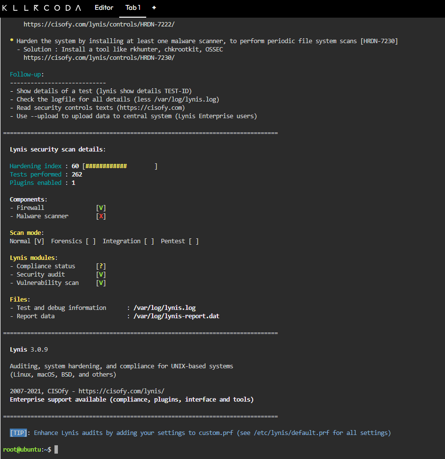
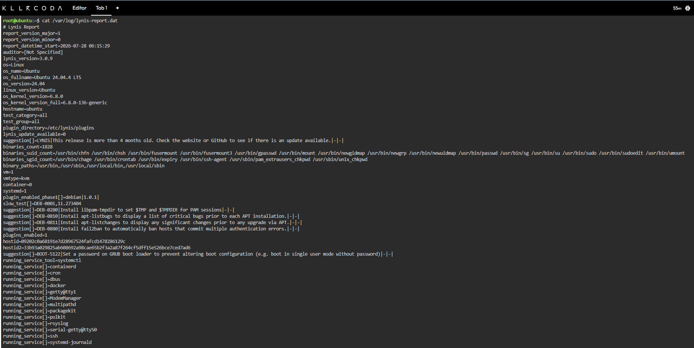

# Sessão 05 – Análise de Vulnerabilidades em Linux e Ferramentas de Auditoria

## Objetivo

O objetivo deste laboratório foi realizar uma auditoria de segurança ao sistema Linux utilizando a ferramenta **Lynis**, identificando vulnerabilidades, recomendações de hardening e oportunidades de melhoria de acordo com boas práticas de segurança (CIS Benchmarks).

---

## Ambiente

- Plataforma: KillerCoda Ubuntu Playground
- Sistema Operativo: Ubuntu 24.04
- Ferramenta utilizada: Lynis 3.0.9

---

# Instalação do Lynis

## Comando

```bash
sudo apt update && sudo apt install lynis -y
```

A ferramenta Lynis foi instalada com sucesso através do gestor de pacotes APT.



---

# Auditoria do Sistema

## Comando

```bash
sudo lynis audit system
```

Foi executada uma auditoria completa ao sistema operativo para identificar configurações inseguras e recomendações de hardening.



---

# Resultados da Auditoria

Após a conclusão da auditoria foram obtidos os seguintes resultados:

| Informação | Valor |
|------------|-------|
| Hardening Index | **60** |
| Testes executados | **262** |
| Plugins ativos | **1** |

Também foi possível verificar:

- Firewall identificada;
- Ausência de scanner de malware instalado;
- Execução da auditoria em modo **Normal**.



---

# Sugestões de Hardening

O relatório apresentou várias recomendações para melhorar a segurança do sistema.

Duas sugestões relevantes foram:

### 1. Instalar Fail2Ban

O Lynis recomenda instalar o **Fail2Ban** para bloquear automaticamente endereços IP após várias tentativas falhadas de autenticação SSH.

**Benefício:**

- Redução do risco de ataques de força bruta.

---

### 2. Definir palavra-passe para o GRUB

O relatório recomenda proteger o gestor de arranque (GRUB) com uma palavra-passe.

**Benefício:**

- Impede alterações não autorizadas ao processo de arranque do sistema.

---

## Relatório do Lynis

Foi também consultado o ficheiro de relatório gerado automaticamente pelo Lynis.

```bash
cat /var/log/lynis-report.dat
```

Este ficheiro contém informações detalhadas sobre os testes executados, sugestões de melhoria e configurações analisadas.



---

# Aprendizagens

Durante este laboratório pratiquei:

- Instalação de ferramentas de auditoria de segurança;
- Execução de auditorias automatizadas com o Lynis;
- Interpretação do Hardening Index;
- Identificação de recomendações de segurança;
- Consulta do relatório gerado pelo Lynis.

---

# Conclusão

Este laboratório permitiu compreender como ferramentas de auditoria automatizada podem ser utilizadas para avaliar o nível de segurança de um sistema Linux e identificar medidas de hardening que contribuem para melhorar a sua proteção. :contentReference[oaicite:1]{index=1}
