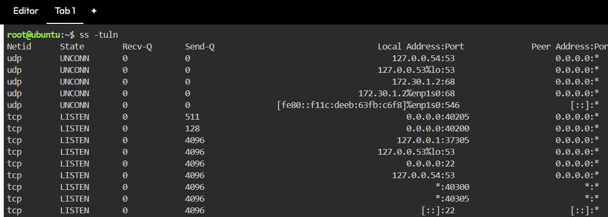
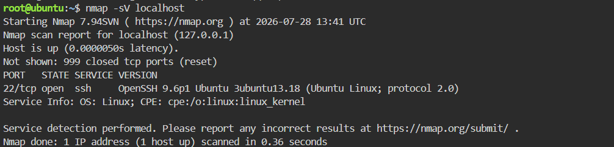
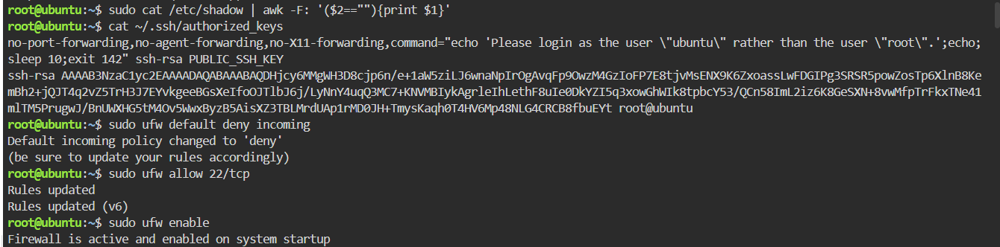
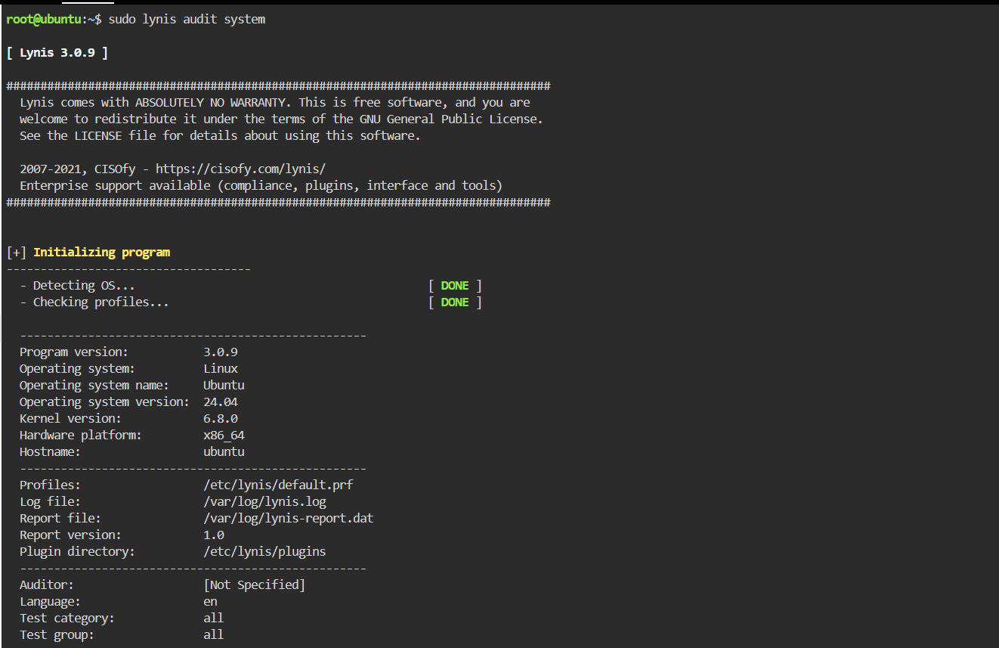
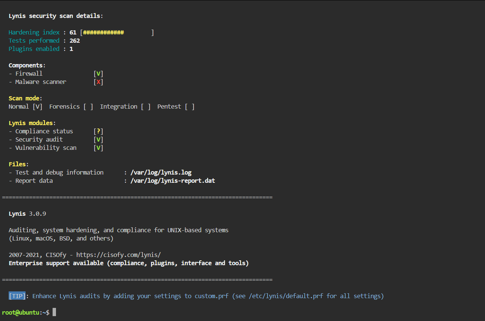

# Sessão 06 – Mini CTF Defensivo Linux

## Objetivo

O objetivo deste laboratório foi realizar uma auditoria de segurança a um sistema Linux, identificar configurações inseguras, aplicar medidas de contenção e remediação, e validar a melhoria da postura de segurança utilizando a ferramenta Lynis.

---

## Ambiente

- Plataforma: KillerCoda
- Sistema Operativo: Ubuntu 24.04
- Ferramentas utilizadas:
  - ss
  - Nmap
  - UFW
  - SSH
  - Lynis

---

# Fase 1 – Identificação e Triagem

## Portas e serviços ativos

### Comando

```bash
ss -tuln
```

Foi realizada a identificação das portas em escuta na máquina local.

Observou-se que o serviço SSH se encontrava ativo na porta **22/TCP**, juntamente com outros serviços locais necessários ao funcionamento do sistema.



---

## Enumeração de serviços

### Comando

```bash
nmap -sV localhost
```

Resultado obtido:

| Porta | Estado | Serviço | Versão |
|--------|---------|----------|---------|
| 22/TCP | Open | SSH | OpenSSH 9.6p1 Ubuntu |

Foi identificado apenas o serviço SSH exposto na porta 22.



---

## Auditoria de Contas

### Verificação de contas sem palavra-passe

```bash
sudo cat /etc/shadow | awk -F: '($2==""){print $1}'
```

Não foram identificadas contas locais sem palavra-passe configurada.

---

## Verificação de chaves SSH

```bash
cat ~/.ssh/authorized_keys
```

Foi analisado o ficheiro `authorized_keys` para verificar a existência de chaves públicas autorizadas.



---

# Fase 2 – Contenção

Foi configurada a firewall UFW para permitir apenas o acesso SSH.

### Comandos executados

```bash
sudo ufw default deny incoming
sudo ufw allow 22/tcp
sudo ufw enable
```

Esta configuração reduz a superfície de ataque do sistema, bloqueando todas as ligações de entrada, exceto o serviço SSH.

---

# Fase 3 – Remediação

Foi verificada a configuração do serviço SSH e aplicadas boas práticas de hardening.

Medidas implementadas:

- Desativação do login direto do utilizador root.
- Desativação da autenticação por palavra-passe.
- Utilização preferencial de autenticação por chave pública.

Estas alterações reduzem significativamente o risco de ataques de força bruta e de acesso não autorizado ao servidor.

---

# Fase 4 – Validação

Para validar a postura de segurança do sistema foi utilizada a ferramenta **Lynis**.

### Comando

```bash
sudo lynis audit system
```

## Resultado

| Informação | Valor |
|------------|-------|
| Hardening Index | **61** |
| Testes executados | **262** |
| Plugins ativos | **1** |

Foi ainda possível verificar:

- Firewall ativa.
- Scanner de malware não instalado.
- Auditoria executada com sucesso.





---

# Aprendizagens

Durante este laboratório foi possível praticar:

- Identificação de portas e serviços ativos;
- Enumeração de serviços utilizando o Nmap;
- Auditoria de contas locais;
- Verificação de chaves SSH autorizadas;
- Configuração da firewall UFW;
- Hardening do serviço SSH;
- Validação da segurança do sistema com o Lynis.

---

# Conclusão

Este laboratório permitiu integrar conhecimentos de administração Linux e cibersegurança, realizando uma auditoria completa ao sistema, aplicando medidas de contenção e remediação e validando a melhoria da postura de segurança através de ferramentas de análise e hardening.
